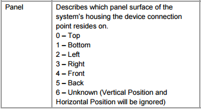
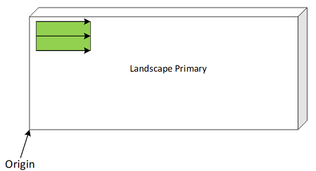
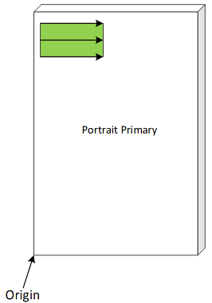
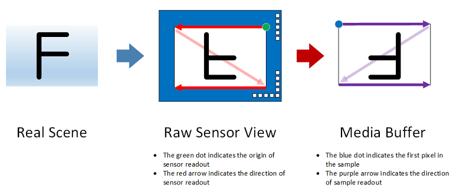

# Driver Support for Camera Orientation

Starting with Window 10, version 1607, all camera drivers are required to explicitly specify the camera orientation regardless if the camera is mounted in accordance with the [Minimum hardware requirements](https://docs.microsoft.com/en-us/windows-hardware/design/minimum/minimum-hardware-requirements-overview). 

Specifically, a camera driver must set a new **Rotation** field in the ACPI \_PLD structure associated with a capture device interface:

```
typedef struct _ACPI_PLD_V2_BUFFER {

    UINT32 Revision:7;
    UINT32 IgnoreColor:1;
    UINT32 Color:24;
    // ...
    UINT32 Panel:3; // Already supported by camera.
    // ...
    UINT32 CardCageNumber:8;
    UINT32 Reference:1;
    UINT32 Rotation:4;  // 0 – Rotate by 0° clockwise
                        // 1 – Rotate by 45° clockwise (N/A to camera)
                        // 2 – Rotate by 90° clockwise
                        // 3 – Rotate by 135° clockwise (N/A to camera)
                        // 4 – Rotate by 180° clockwise
                        // 5 – Rotate by 225° clockwise (N/A to camera)
                        // 6 – Rotate by 270° clockwise
     UINT32 Order:5;
     UINT32 Reserved:4;

     //
     // _PLD v2 definition fields.
     //

     USHORT VerticalOffset;
     USHORT HorizontalOffset;

 } ACPI_PLD_V2_BUFFER, *PACPI_PLD_V\_BUFFER;
 ```

For camera, the **Rotation** field in an ACPI \_PLD structure specifies the number of degrees ('0' for 0°, '2' for 90°, '4' for 180°, and '6' for 270°) a captured frame is rotated relative to the screen while the display is in its native orientation.

Based on the value in the **Rotation** field, an application can perform additional rotation, if necessary, in order to render captured frames correctly.

## Design overview


For those devices whose cameras and displays share the same housing or *enclosure*/*casing* (phones, tablets, notebooks, and all-in-one PCs), it is possible to have these peripherals be mounted on different surfaces (front/back, top/bottom, or left/right surface of an enclosure) with each of them being rotated by a fixed yet arbitrary degrees on its respective plane (typically limited to 0, 90, 180, or 270 degrees clockwise in practice). Note that traditional desktop PCs do not fall into this category as cameras and displays are typically connected as external peripherals and they can be physically manipulated in 3D space at runtime.

Consequently, an application needs a mechanism to describe the spatial relationship between the two peripherals such that a captured frame can be transposed onto the rendering surface in the correct orientation.

One way to solve the problem is to use the ACPI \_PLD structure which already has the concepts of *surface* and *degrees of rotation* defined (see [http://www.uefi.org/acpi](http://www.uefi.org/acpi) for the full specification). For example, the \_PLD structure already has *panel* field which specifies the surface on which a peripheral reside:

 

*Definition of ACPI \_PLD Panel field (Rev. 5.0a)*

The next two diagrams illustrate the definition of each panel visually:


*Panel definitions for desktop PCs and most devices*


*Panel definitions for foldable devices*

The concept of an ACPI *panel* is already adopted by Windows where:

-   A camera device interface is associated with a \_PLD structure with the Panel field being set accordingly if a capture device is statically mounted at a fixed location.

-   An application can retrieve the panel on which a capture device resides by calling the [Windows.Devices.Enumeration.DeviceInformation.EnclosureLocation.Panel](https://docs.microsoft.com/en-us/uwp/api/Windows.Devices.Enumeration.EnclosureLocation#Windows_Devices_Enumeration_EnclosureLocation_Panel) property.

The ACPI \_PLD structure also has a Rotation field defined as follow:


*Definition of ACPI \_PLD Rotation field (Rev 5.0a)*

Instead of using the definition above "as is", we'll further refine it to avoid ambiguity:

- For camera, the Rotation field in an ACPI \_PLD structure specifies the number of degrees ('0' for 0°, '2' for 90°, '4' for 180°, and '6' for 270°) a captured frame is rotated relative to the screen while the display is in its native orientation.

## Landscape Primary vs. Portrait Primary

s
Depending on the form factor, devices may be defined as Landscape Primary or Portrait Primary, this is defined as the value returned from [Windows.Graphics.Display.DisplayInformation.NativeOrientation](https://docs.microsoft.com/en-us/uwp/api/Windows.Graphics.Display.DisplayInformation#Windows_Graphics_Display_DisplayInformation_NativeOrientation) property.

Regardless of whether a device is Landscape or Portrait Primary, the ACPI's definition of *origin* is always the lower left corner of the panel as the user is facing the panel. The recommended mounting orientation for camera sensors is such that the scan lines of the sensor goes from left to right horizontally from the ACPI panel's lower left corner (origin) to the lower right corner.

This is the Reference Orientation of the sensor.



*Landscape Primary : Sensor Scan Direction*

Similarly, for Portrait Primary, the Reference Orientation of the sensor is as diagramed below:



*Portrait Primary : Sensor Scan Direction*

This ensures that when the Gyro/Accelerometer sensor generates notifications for the relative orientation of the device, the reference point of the Gyro/Accelerometer is consistent with the reference orientation of the sensor: I.e., apps can simply obtain the relative orientation of the device and adjust the media frame based only on that information.

## Non-Reference Orientation Mounting


Due to hardware/form factor constraints, often sensors need to be mounted at an offset from the Reference Orientation. When this is done, the OEM/IHV must implement one of the following two solutions:

1.  **RECOMMENDED**: Auto correct the orientation. The Sensor Driver and Camera Driver must create a custom protocol between the two drivers to indicate the current Sensor Orientation and have the Camera Driver stack “correct” the resulting frames.

2.  Indicate the offset in the \_PLD's Rotation field.

### Auto-Correct

This is the *recommended* solution to non-Reference Orientation mounting of camera sensors. This is to ensure app compatibility since the majority of the applications already written to use camera feeds do not know to check for, nor correct for Rotation information.

This includes any DirectShow applications and most of the MF/MediaCapture based applications.

![NOTE]
> When Auto Correct is used, OEMs and IHVs must NOT advertise the actual orientation of the sensor via the \_PLD's Rotation field. In this case, the Rotation field must indicate the orientation after the correction: 0 degrees*.

### \_PLD Rotation

If hardware constraint limits the system from auto-correcting the captured frames, the recommended solution to indicate the offset from the Reference Orientation so Rotation aware apps can compensate.

This solution is not ideal since as stated above, many existing applications do not handle (or even expect) non-Reference Orientation Rotation information. This will result in a significant app compat issue where applications will end up capturing and rendering video frames with an incorrect orientation.

The following diagrams illustrate the values of the \_PLD Rotation field for each hardware configuration:

**Rotation: 0 degree clockwise (Reference Orientation)**


In the diagram above:

-   The picture on the left illustrates the scene to capture.

-   The picture in the middle depicts how a scene is viewed by a CMOS sensor whose physical readout order starts from the bottom-left corner moving from left to right upwards. At hardware level, the CMOS sensor in this example flips the scene vertically but not horizontally.

-   The picture on the right represents the output of the camera driver. In this example, the content of the media buffer can be rendered directly while the display is its native orientation without additional rotation. Consequently, the ACPI \_PLD Rotation field has a value of 0.


**Rotation: 90 degrees clockwise**


In this case, the content of the media buffer is rotated by 90 degrees clockwise compared to the original scene. As a result, the ACPI \_PLD Rotation field has a value of 2.

The application reading the \_PLD Rotation information would correct the image by counter-rotating the resulting image by 90 degrees counter clockwise.


**Rotation - 180 degrees clockwise**



In this case, the content of the media buffer is rotated by 180 degrees clockwise compared to the original scene. As a result, the ACPI \_PLD Rotation field has a value of 4.

The application reading the \_PLD Rotation information would correct the image by counter-rotating the resulting image by 180 degrees.


**Rotation: 270 degrees clockwise**


In this case, the content of the media buffer is rotated by 270 degrees clockwise compared to the original scene. As a result, the ACPI \_PLD Rotation field has a value of 6.

The application reading the \_PLD Rotation information would correct the image by counter-rotating the resulting image by 90 degrees clockwise (equivalent to 270 degrees counter clockwise).


