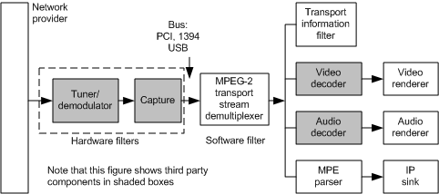

# Combining Nodes in a Filter

## 

The following figure of a sample DirectShow filter graph shows one possible way in which the control nodes can be represented as filters in a filter graph. The network provider is always its own filter and precedes all other filters. In this sample, because the tuner and demodulator nodes are combined on the same circuit card, they appear as one filter. The capture filter follows the tuner/demodulator filter. For all of these filters so far, the actual internal and external connections in the filter match the control nodes. The next filter downstream is the MPEG-2 transport stream demultiplexer, which is represented by a single filter that exposes the packet identifier (PID) filters as shown in the figure in the [Control Nodes](control-nodes.md) section. The actual MPEG-2 transport stream demultiplexer filter reproduces the topology as many times as necessary to handle all the elementary streams.

 

 

--------------------
[Send comments about this topic to Microsoft](mailto:wsddocfb@microsoft.com?subject=Documentation%20feedback%20%5Bstream\stream%5D:%20Combining%20Nodes%20in%20a%20Filter%20%20RELEASE:%20%288/23/2016%29&body=%0A%0APRIVACY%20STATEMENT%0A%0AWe%20use%20your%20feedback%20to%20improve%20the%20documentation.%20We%20don't%20use%20your%20email%20address%20for%20any%20other%20purpose,%20and%20we'll%20remove%20your%20email%20address%20from%20our%20system%20after%20the%20issue%20that%20you're%20reporting%20is%20fixed.%20While%20we're%20working%20to%20fix%20this%20issue,%20we%20might%20send%20you%20an%20email%20message%20to%20ask%20for%20more%20info.%20Later,%20we%20might%20also%20send%20you%20an%20email%20message%20to%20let%20you%20know%20that%20we've%20addressed%20your%20feedback.%0A%0AFor%20more%20info%20about%20Microsoft's%20privacy%20policy,%20see%20http://privacy.microsoft.com/default.aspx. "Send comments about this topic to Microsoft")

