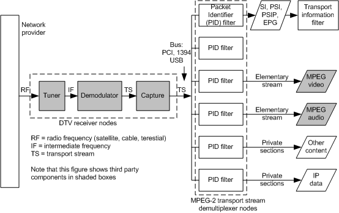

# Control Nodes

## 

The following figure shows an example of one possible functional topology that receives digital broadcast content. It illustrates the operations necessary to:

-   tune and demodulate the signal.

-   capture and demultiplex the signal.

-   obtain electronic program guide (EPG) information.

-   obtain audio and video content.

-   obtain IP data.

Note that some functions in receiver topology that acquire content, such as the tuner, are always associated with hardware. Other functions, such as content stream demultiplexing, can be performed with hardware or software components. Still others, such as the transport information filter (TIF) and network provider filter, are always software components.

The blocks in the preceding figure correspond to BDA control nodes. Each control node combines network and program-specific parameter data with the input signal, or signal component, using a standard algorithm. The result produces a new signal component that is useful to the control nodes connected immediately downstream.

 

 

--------------------
[Send comments about this topic to Microsoft](mailto:wsddocfb@microsoft.com?subject=Documentation%20feedback%20%5Bstream\stream%5D:%20Control%20Nodes%20%20RELEASE:%20%288/23/2016%29&body=%0A%0APRIVACY%20STATEMENT%0A%0AWe%20use%20your%20feedback%20to%20improve%20the%20documentation.%20We%20don't%20use%20your%20email%20address%20for%20any%20other%20purpose,%20and%20we'll%20remove%20your%20email%20address%20from%20our%20system%20after%20the%20issue%20that%20you're%20reporting%20is%20fixed.%20While%20we're%20working%20to%20fix%20this%20issue,%20we%20might%20send%20you%20an%20email%20message%20to%20ask%20for%20more%20info.%20Later,%20we%20might%20also%20send%20you%20an%20email%20message%20to%20let%20you%20know%20that%20we've%20addressed%20your%20feedback.%0A%0AFor%20more%20info%20about%20Microsoft's%20privacy%20policy,%20see%20http://privacy.microsoft.com/default.aspx. "Send comments about this topic to Microsoft")

