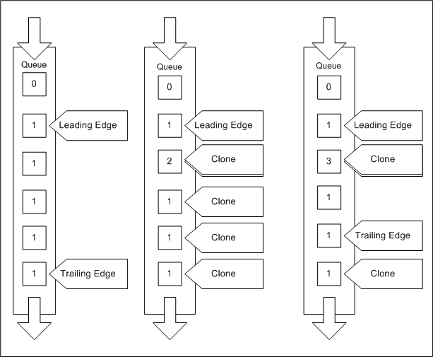

# Leading and Trailing Edge Stream Pointers

By default, each AVStream queue contains a *leading edge* stream pointer. The leading edge points to new frames as they arrive into the queue. Specifically, the leading edge initially points to the first frame to arrive into the queue and does not move until the minidriver moves it. AVStream creates the leading edge, which then exists for the lifetime of the queue. Minidrivers can manipulate the leading edge using functions provided by Microsoft.

When a new frame arrives in a queue, AVStream sets the leading edge to point to this frame, provided that the leading edge does not already point to a frame.

To obtain a pointer to the leading edge stream pointer, the minidriver calls [**KsPinGetLeadingEdgeStreamPointer**](https://msdn.microsoft.com/library/windows/hardware/ff563513).

The minidriver is responsible for advancing the leading edge in all but the two situations summarized in the following table.

<table>
<colgroup>
<col width="50%" />
<col width="50%" />
</colgroup>
<thead>
<tr class="header">
<th>Situation</th>
<th>AVStream's Behavior</th>
</tr>
</thead>
<tbody>
<tr class="odd">
<td>
A frame arrives in a previously empty queue.
</td>
<td>
AVStream sets the leading edge to point to this frame.
</td>
</tr>
<tr class="even">
<td>
The leading edge points to a frame. The IRP corresponding to this frame is canceled.
</td>
<td>
AVStream advances the leading edge. The leading edge now points to a newer frame.
</td>
</tr>
</tbody>
</table>

 

See [Introduction to Stream Pointers](introduction-to-stream-pointers.md) For more information about advancing stream pointers.

### Specifying a Trailing Edge Stream Pointer

Minidrivers can specify that a queue have a trailing edge stream pointer. The trailing edge usually indicates the oldest frame of interest to the minidriver. To specify a trailing edge, set the KSPIN\_FLAG\_DISTINCT\_TRAILING\_EDGE flag in the **Flags** member of the relevant [**KSPIN\_DESCRIPTOR\_EX**](https://msdn.microsoft.com/library/windows/hardware/ff563534) structure. Then call [**KsPinGetTrailingEdgeStreamPointer**](https://msdn.microsoft.com/library/windows/hardware/ff563518) to obtain a pointer to the trailing edge stream pointer.

When the trailing edge advances, the reference count on the frame to which it previously pointed drops to zero and the frame completes. If the frame is the last contained within its IRP, a sink pin completes the IRP to the caller; a source pin sends the IRP to the pin to which it is connected.

### Maintaining a Frame Window

As a result of the frame reference count rules described in [Introduction to Stream Pointers](introduction-to-stream-pointers.md), a frame between the leading and trailing edge remains in the queue until it is canceled*, even if the frame is not referenced by a stream pointer*. As such, a minidriver can use the leading and trailing edge pointers to maintain a working window of multiple contiguous frames. Frames in the window might be awaiting processing or filling, for example.

In the following diagram, the oldest frames are at the bottom. New frames arrive at the top. The number in each frame is the reference count for that frame. When the stream pointers advance, they move up in this diagram.

The leftmost queue shows how the minidriver can use a trailing edge to create a working set of frames. Each frame between the leading and trailing edge has a reference count of one despite the fact that no stream pointers reference these frames.

The middle queue is an example of [Cloning Stream Pointers](cloning-stream-pointers.md). The driver has repeatedly cloned and then advanced the leading edge, as described in the pin process steps in [AVStream DMA Services](avstream-dma-services.md).

The rightmost queue shows how the minidriver can maintain reference count for a frame behind the trailing edge by using a stream pointer clone.

 

 

