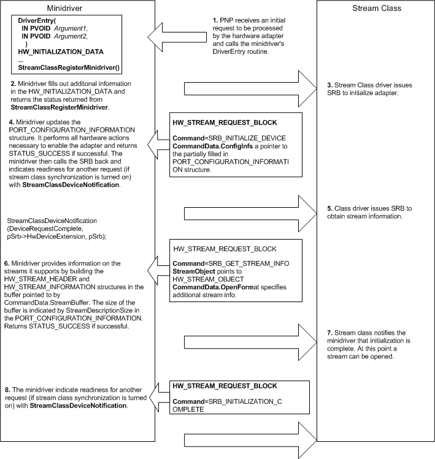

# Stream Class and Minidriver Interface

## 

The stream class interface is primarily a set of function calls between the class driver and the minidriver. The class driver controls the request flow, calling the adapter minidriver when access to the adapter hardware is necessary. The class driver is responsible for multiprocessor and interrupt synchronization. After both the class driver and the minidriver are initialized, the minidriver is passive and is called only by the class driver. Most of the function calls from the minidriver to the class driver are low-level service requests.

The basic mechanism controlling commands and information to the minidriver is the *stream request block* (SRB). A set of SRBs is provided for each minidriver to access particular capabilities of a driver and are usually specific for each data stream supported by the device. This information is passed to the device through an operating-system-controlled DMA in a large circular buffer.

An SRB comprises a command and data associated with that command. A [**HW\_STREAM\_REQUEST\_BLOCK**](https://msdn.microsoft.com/library/windows/hardware/ff559702) structure contains all information relating to a specific SRB. This structure, often referred to simply as an SRB, contains additional parameters to supplement the command.

The following illustration shows the interaction between the stream class and the minidriver during initialization.

All streaming minidriver functions are optionally synchronized with the minidriver's interrupt service routine (ISR), making the minidrivers nonreentrant. In other words, when a thread is executing in the minidriver, no calls will be made to any other function within the minidriver, including the ISR. This nonreentrant condition holds true even on multiprocessor Windows NT/Windows 2000 systems, making the minidrivers easier to write. The stream class driver achieves this nonreentrant condition by masking off the IRQ of the streaming minidriver (and all lower priority IRQs) using **KeSynchronizeExecution** when code is executing in any of the minidriver's routines. For more information about synchronization, see [Minidriver Synchronization](minidriver-synchronization.md).

The streaming minidriver can call WDM system services as necessary. However, the minidriver does not allocate a device object but uses the class driver's device object to make system calls. Most minidrivers do not need to make WDM system calls, because all necessary functionality is available from the class driver.

Minidrivers must be aware that all minidriver entry points are called at IRQL &gt; DISPATCH\_LEVEL when making WDM system service calls, except for the [**StreamClassCallAtNewPriority**](https://msdn.microsoft.com/library/windows/hardware/ff568230) routine. This function allows service calls at IRQL = DISPATCH\_LEVEL or PASSIVE\_LEVEL, depending on the priority specified. This limitation on IRQL can be overridden by setting the **TurnOffSynchronization** Boolean in the [**HW\_INITIALIZATION\_DATA**](https://msdn.microsoft.com/library/windows/hardware/ff559682) structure to **TRUE**.

 

 

--------------------
[Send comments about this topic to Microsoft](mailto:wsddocfb@microsoft.com?subject=Documentation%20feedback%20%5Bstream\stream%5D:%20Stream%20Class%20and%20Minidriver%20Interface%20%20RELEASE:%20%288/23/2016%29&body=%0A%0APRIVACY%20STATEMENT%0A%0AWe%20use%20your%20feedback%20to%20improve%20the%20documentation.%20We%20don't%20use%20your%20email%20address%20for%20any%20other%20purpose,%20and%20we'll%20remove%20your%20email%20address%20from%20our%20system%20after%20the%20issue%20that%20you're%20reporting%20is%20fixed.%20While%20we're%20working%20to%20fix%20this%20issue,%20we%20might%20send%20you%20an%20email%20message%20to%20ask%20for%20more%20info.%20Later,%20we%20might%20also%20send%20you%20an%20email%20message%20to%20let%20you%20know%20that%20we've%20addressed%20your%20feedback.%0A%0AFor%20more%20info%20about%20Microsoft's%20privacy%20policy,%20see%20http://privacy.microsoft.com/default.aspx. "Send comments about this topic to Microsoft")

