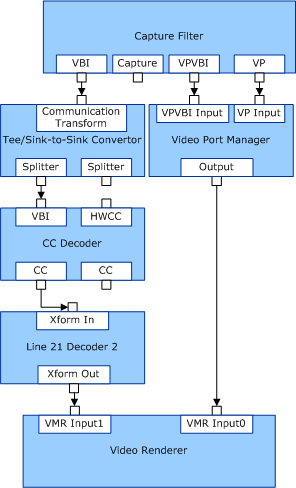

# Video Port-Based Capture

Capture devices that are based on video ports must provide a video port pin that connects to the video port manager. The video port pin allows hardware-based transport to display the preview stream without CPU or peripheral component interconnect (PCI) bus overhead. A separate pin provides capture capability (for example, when captured video must be written to disk). During the capture process, the capture buffers are provided to the display driver, which fills the buffer by bus mastering. The interaction between the capture minidriver and the display driver is described in further detail later in this section and in [Kernel-Mode Video Transport](https://msdn.microsoft.com/library/windows/hardware/ff568180).

On systems that run Microsoft Windows 98 SE or Windows 2000, the Overlay Mixer filter (part of the Video Port Manager filter in later operating systems) does not support video port connections on secondary monitors. The pin connection fails in this case. Video port connections on secondary monitors are supported on systems that run Windows Millennium Edition (Windows Me) and Windows XP.

If a device supports VBI capture, it typically exposes two additional pins: VPVBI and VBI. The video port manager filter uses the VPVBI pin to allocate video port surfaces for VBI capture. The VBI pin itself provides the raw VBI samples.

The following diagram shows the separate paths for VPVBI and VBI capture.

Property sets that are specific to this type of filter graph are [KSPROPSETID\_VPConfig and KSPROPSETID\_VPVBIConfig](https://msdn.microsoft.com/library/windows/hardware/ff566703) and [PROPSETID\_ALLOCATOR\_CONTROL](https://msdn.microsoft.com/library/windows/hardware/ff567792).

### Using the Video Port Extensions (VPEs)

**Note:** The following paragraphs apply only to operating systems preceding the next version of Windows Vista. VPE is disabled in Windows Vista if the display driver uses the new Windows Vista Driver Display Model (LDDM).

Video capture minidrivers can use the [**DxApi**](https://msdn.microsoft.com/library/windows/hardware/ff557364) function to communicate with the video miniport driver to allow capture streaming video to be transported across the video port bus between the capture hardware and the display hardware. The stream consists of sequential fields of NTSC, PAL, or SECAM video, and can include blanking (VBI) and timecode (horizontal synchronization and vertical synchronization) data. Video stream characteristics, including dimension, color format, frequency, scaling, and cropping are configured in user mode through the VPE DirectDraw interface. After streaming has started, **DxApi** is then called in kernel mode to capture individual frames. To support display changes, such as changes in resolution or switching to or from full-screen command prompts, video capture minidrivers must also register with the video miniport driver so they can respond to such display change events.

The VPEs and the **DxApi** function were introduced to the DirectDraw DDI with DirectX 5.0. **DxApi** is supported by the video miniport driver in Windows 2000 and later operating systems. A virtual display miniport driver (miniVDD) supports **DxApi** in the Windows 98 and Windows Me operating systems. To enable kernel-mode video transport using **DxApi**, a WDM video capture minidriver must include the *ddkmapi.h* (DirectDraw kernel-mode API) header file and link with the *dxapi.lib* library. The **DxApi** library uses functionality exported by *dxapi.sys*. *DxApi.sys* is available only when DirectDraw is loaded because **DxApi** is part of the VPEs to the DirectDraw DDI.

**DxApi** is a single kernel-mode API that is exposed by *DxApi.sys*. The Video Port Extension is a user-mode API that is exposed by *DDraw.dll*. A video capture minidriver must make several different calls to **DxApi** to set up and configure the video port hardware to stream correctly.

**DxApi** is a single function that encapsulates multiple function identifiers. Minidrivers pass the desired function identifier in the first argument to **DxApi**. The remaining arguments to **DxApi** are for the minidriver-allocated buffers for the structures that correspond to function identifiers and lengths of buffers. The behavior of the functions and the size and format of the input and output buffers depend on the specified function identifier. This behavior is documented in [DxApi Function and Identifiers](https://msdn.microsoft.com/library/windows/hardware/ff557393).

The WDK provides two sample drivers that show how to implement the **DxApi** functionality. The ATIWDM sample requires specific hardware to be present to operate. The TestCap sample does not require hardware and works on all platforms. You can use the GraphEdt tool to interact with either sample.

The common functions that a video capture minidriver must call **DxApi** to perform are the following:

-   Open a handle to kernel-mode DirectDraw (**DxApi** function identifier set to DD\_DXAPI\_OPENDIRECTDRAW). This operation must be performed at IRQL = PASSIVE\_LEVEL.

-   Get the hardware video port's kernel-mode capabilities (**DxApi** function identifier set to DD\_DXAPI\_GETKERNELCAPS).

-   Register callbacks to handle DirectDraw events, such as mode switches to a full-screen command prompt (**DxApi** function identifier set to DD\_DXAPI\_REGISTER\_CALLBACK).

-   Open a handle to target DirectDraw surfaces (**DxApi** function identifier set to DD\_DXAPI\_OPENSURFACE).

-   Unregister callbacks (**DxApi** function identifier set to DD\_DXAPI\_UNREGISTER\_CALLBACK).

-   Close handles to surfaces as well as to kernel-mode DirectDraw (**DxApi** function identifier set to DD\_DXAPI\_CLOSEHANDLE)

### Video Port Child Devices and Power Management

Video port child devices, such as TV tuner and display combination adapters, can block power state transitions when the minidriver is in use. The power state transition blocking occurs when the minidriver is actively in use (pins or filters are open). If the minidriver is loaded but has no pins or filters in use, power state transitions from S0 (fully powered) to lower power states (for example, S1, S2, S3, and S4) will occur. Power state transition blocking only occurs with Stream class minidrivers that are clients of video port child devices.

A WHQL waiver is available for devices that meet this criteria, so vendors can still obtain a logo.

 

 

