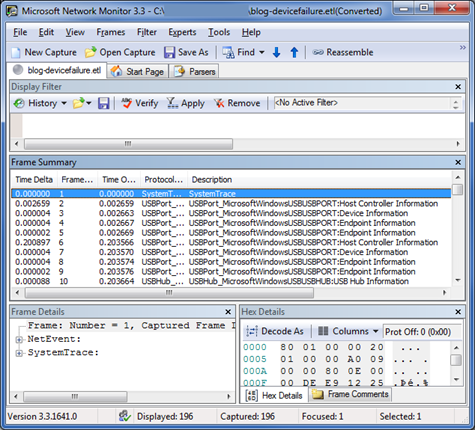
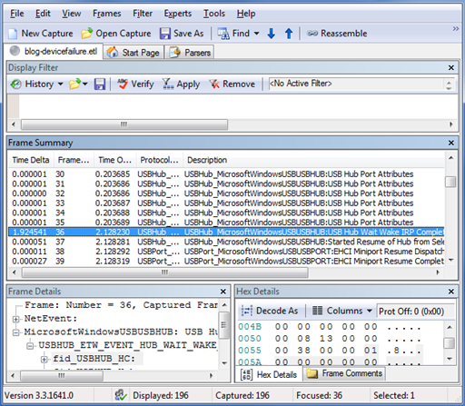
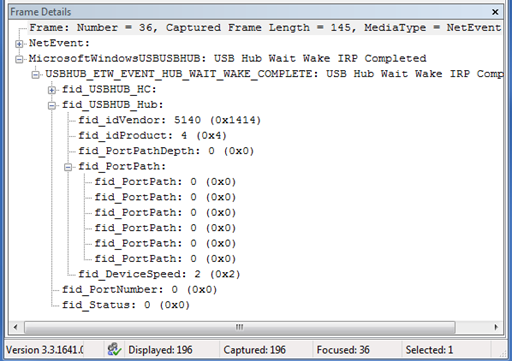
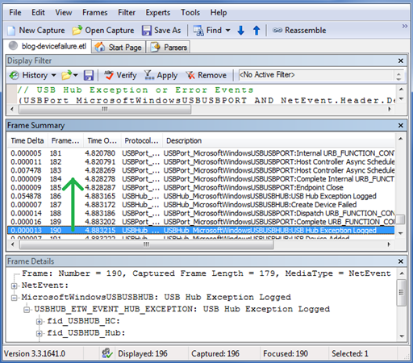

# Case Study: Troubleshooting an unknown USB device by using ETW and Netmon


This topic provides an example of how to use USB ETW and Netmon to troubleshoot a USB device that Windows does not recognize.

For this example, we plugged in a device and it appeared as an unknown device in Device Manager and other parts of the user interface (UI). The Hardware ID was USB\\UNKNOWN. To diagnose further, we unplugged the device, began an ETW trace, and plugged in the device again. After the device appeared as an unknown device, we stopped the trace.

-   [About the Unknown Device Problem](#about-the-unknown-device-problem)
-   [Starting the Event Trace Analysis](#starting-the-event-trace-analysis)
-   [USB Device Summary Events](#usb-device-summary-events)
-   [Event Description and Data Payload](#event-description-and-data-payload)
-   [USB Netmon Filters](#usb-netmon-filters)
-   [Understanding Error Events and Status Codes](#status-codes)
-   [Reading Backwards from Problem Events](#reading-backwards-from-problem-events)
-   [Related topics](#related-topics)

## About the Unknown Device Problem


To debug an unknown USB device problem, it helps to understand what the USB driver stack does to enumerate a device when a user plugs it into the system. For information on USB enumeration, see the blog post titled [How does USB stack enumerate a device?](http://go.microsoft.com/fwlink/p/?linkid=617517)

Typically when the USB driver stack fails to enumerate a device, the hub driver still reports the arrival of the device to Windows and the USB device is marked as an unknown device in Device Manager. The device has a Device ID of USB\\VID\_0000&PID\_0000 and a Hardware ID and Compatible ID of USB\\UNKNOWN. The following events cause the USB hub driver to enumerate a USB device as an unknown device:

-   A port reset request timed out during enumeration.
-   The Set Address request for the USB device failed.
-   The request for the USB device's Device Descriptor failed.
-   The [USB Device Descriptor](usb-device-descriptors.md) was malformed and failed validation.
-   The request for the Configuration Descriptor failed.
-   The [USB Configuration Descriptor](usb-configuration-descriptors.md) was malformed and failed validation.

In Windows 7, unknown devices that fail enumeration are marked with failure [Code 43](http://go.microsoft.com/fwlink/p/?linkid=617523) in Device Manager.

If a device is marked with failure [Code 28](http://go.microsoft.com/fwlink/p/?linkid=617525) in Device Manager, the device enumerated successfully but is still an unknown device. This failure code indicates that the device did not provide a Product ID string during enumeration and Windows could not find a matching INF for the device to install a driver.

## Starting the Event Trace Analysis


Because this is a device failure, we recommend that you use Netmon with the USB parser to analyze the log file.

**To view the event trace log**

1.  Run Netmon, click **File -&gt; Open -&gt; Capture**, and then select the file.
2.  Select the first event in the **Frame Summary** pane, which has the description SystemTrace. This image shows what the screen looks like when you select the first event.

    

3.  To customize the columns that Netmon displays, right-click a column name and select **Choose Columns**.
4.  The first event, which is identified as type **SystemTrace**, contains general information about the log. You can expand the information tree in the **Frame Details** pane to see information such as the number of events lost and the trace start time.

## USB Device Summary Events


Event 2 is the first USB event in the log. This and several subsequent events describe the USB host controllers, hubs, and devices that were connected to the system when we started the trace. We can call this group of events the device summary events, or just summary events. Like the first event, the summary events do not describe driver activity. Summary events record the state of the devices at the start of a logging session. Other events represent something happening on the bus, interactions with client drivers or the system, or changes of internal state.

The USB hub and USB port drivers both log summary events. The driver that logged an event is identified in the Protocol Name column. For example, an event that is logged by the USB port driver has the USBPort\_MicrosoftWindowsUSBPORT protocol name. A USB event trace typically contains a sequence of port summary events, followed by a sequence of hub summary events. Many of the USB port and USB hub summary events have the words “Information” or “Attributes” in their description.

How can you identify the end of the summary events? If there is a significant break in the timestamp pattern among the USB hub events at the start of the log, that break is probably the end of the device summary. Otherwise, the first USB port event after any USB hub events is likely the first non-summary event. Figure 3 on the following page shows the first non-summary event in this sample trace.

In this example, the device of interest was not connected to the system when we started the trace, so you can skip the device summary events for now.



## Event Description and Data Payload


In the sample log, the first event after the device summary events is a USB Hub Wait Wake IRP Completed event. We plugged in a device, and a host controller or a hub is waking up in response. To determine which component is waking up, look at the event's data. The data is in the Frame Details pane, which is shown in a tree structure in approximately the following form:

```
Frame information
ETW event header information
    ETW event descriptor (Constant information about the event ID such
    as error level)
Event payload (Data logged at the time of the event)
    Name of a USB-specific structure
        Structure members and their values (Types: numbers, strings,
        or arrays)
    ...

```

Expand the payload data for the USB Hub Wait Wake IRP Completed event, and you will see an ETW structure that is named fid\_USBHUB\_Hub. The name of the structure has the following components:

<table>
<colgroup>
<col width="50%" />
<col width="50%" />
</colgroup>
<thead>
<tr class="header">
<th>Term</th>
<th>Description</th>
</tr>
</thead>
<tbody>
<tr class="odd">
<td><p><strong>fid_</strong></p></td>
<td><p>A typical prefix for a USB ETW structure.</p></td>
</tr>
<tr class="even">
<td><p> <strong>USBHUB_</strong></p></td>
<td><p>An indication that the USB hub driver logged the event.</p></td>
</tr>
<tr class="odd">
<td><p><strong>The rest of the string</strong></p></td>
<td><p>The name of the object that the structure's data describes. For this event, it is a Hub object.</p></td>
</tr>
</tbody>
</table>

 

The USB hub driver uses the **fid\_USBHUB\_Hub** structure to describe a USB hub. Events that have this hub structure in their data payload refer to a hub, and we can identify the specific hub by using the contents of the structure. Figure 4 shows the Frame Details pane, with the **fid\_USBHUB\_Hub** structure expanded to show its fields.



The hub structure is very similar to two other structures that commonly appear in USB ETW events:**fid\_USBHUB\_Device** and **fid\_USBPORT\_Device**. The following important fields are common to all three structures:

<a href="" id="fid-idvendor"></a>**fid\_idVendor**  
The USB Vendor ID (VID) of the device.

<a href="" id="-fid-idproduct"></a> **fid\_idProduct**  
The USB Product ID (PID) of the device.

<a href="" id="-fid-portpath"></a> **fid\_PortPath**  
The list of one-based hub port numbers through which a USB device is attached. The number of port numbers in the list is contained in the **PortPathDepth** field. For the root hub devices, this list is all zeros. For a USB device that is connected directly to a root hub port, the value in PortPath\[0\] is the root hub port number of the port to which the device is attached. For a USB device that is connected through one or more additional USB hubs, the list of hub port numbers starts with the root hub port and continues with the additional hubs (in the order of distance from the root hub). Ignore any zeros. For example:

| Sample Value         | Description                                                                                                                       |
|----------------------|-----------------------------------------------------------------------------------------------------------------------------------|
| \[0, 0, 0, 0, 0, 0\] | The event refers to a root hub (a port on the PC, directly controlled by a USB host controller).                                  |
| \[3, 0, 0, 0, 0, 0\] | The event refers to a hub or a device that is plugged into a root hub's port number 3.                                            |
| \[3, 1, 0, 0, 0, 0\] | A hub is plugged into a root hub's port 3. The event refers to a hub or a device that is plugged into this external hub's port 1. |

 

You should monitor the port paths of any devices of interest. When a device is being enumerated, the VID and PID are unknown and logged as 0. The VID and PID do not appear during some low-level device requests such as reset and suspend. These requests are sent to the hub that the device is plugged into.

In our sample log, the Wait Wake completion event has a port path with six zeroes. The event indicates a Wait Wake action on a root hub. That is logical because of our actions: we plugged the device into a root hub port, so the root hub is waking up.

## USB Netmon Filters


You can examine each event in a log in chronological order, if you have the time. Even with experience, it is difficult to quickly identify the important events by scanning the list of the event descriptions. To find the cause of the Unknown Device more quickly, you can use the Netmon filter feature.

**The USB Error Filter**

To activate the USB error filter in Netmon, click **Filter -&gt; Display Filter -&gt; Load Filter -&gt; Standard Filters -&gt; USB -&gt; USB Hub Errors**, and then click **Apply** in the **Display Filter** pane.

The USB error filter narrows the list of events to only those that meet the criteria shown in the following table.

| Filter text                                                                       | Description                                                                                                                                               |
|-----------------------------------------------------------------------------------|-----------------------------------------------------------------------------------------------------------------------------------------------------------|
| (USBPort\_MicrosoftWindowsUSBUSBPORT AND NetEvent.Header.Descriptor.Opcode == 34) | USB port events that have opcode 34 are port errors.                                                                                                      |
| (USBHub\_MicrosoftWindowsUSBUSBHUB AND NetEvent.Header.Descriptor.Opcode == 11)   | USB hub events that have opcode 11 are hub errors.                                                                                                        |
| (NetEvent.Header.Descriptor.Level == 0x2)                                         | Events that have level 0x2 are usually errors.                                                                                                            |
| (USBHub\_MicrosoftWindowsUSBUSBHUB AND NetEvent.Header.Descriptor.Id == 210)      | USB hub events with ID 210 are ”USB Hub Exception Logged” events. For more information, see [Understanding Error Events and Status Codes](#status-codes). |

 

This image shows the smaller set of events that appear in the **Frame Summary** pane after we applied the USB error filter to our sample trace log.


To see an overview of the sequence of errors, you can briefly view each error event. Important fields to observe include **fid\_NtStatus**, **fid\_UsbdStatus**, and **fid\_DebugText**. For more information, see [Understanding Error Events and Status Codes](#status-codes). To turn off a filter, click the **Remove** button in the **Display Filter** pane.

**Custom Netmon Filters**

You can create custom filters in Netmon. The easiest method is to create a filter from data on the screen in one of the following ways:

-   Right-click a field in the **Frame Details** pane and select **Add Selected Value to Display Filter**.
-   Right-click a field in the **Frame Summary** pane and select **Add \[field name\] to Display Filter**.

You can change the operators (such as OR, AND, and ==) and the filter values to build the appropriate filter expressions.
## <a href="" id="status-codes"></a>Understanding Error Events and Status Codes


In our unknown device example, most of the USB hub exceptions have a **fid\_DebugText** data of CreateDeviceFailure. It is not clear how serious the exception is, but the debug text gives a hint as to the cause: an operation related to the new device failed. For now, assume that the adjacent Create Device Failed events are redundant. The last two exceptions are CreateDeviceFailure\_Popup and GenErr\_UserIoctlFailed. The popup exception sounds like an error that was exposed to the user, but any and all of these errors could be related to the unknown device problem.

USB error events, and other events, have status values in their data that provide valuable information about the problem. You can find information on status values by using the resources in the following table.

| Status type                                                          | Resource                                                                                                                                                                                                                         |
|----------------------------------------------------------------------|----------------------------------------------------------------------------------------------------------------------------------------------------------------------------------------------------------------------------------|
| **fid\_NtStatus**                                                    | See [NTSTATUS values](http://go.microsoft.com/fwlink/p/?linkid=617532).                                                                                                                                                          |
| The status field of a USB request block (URB) or **fid\_UsbdStatus** | Look up the value as a USBD\_STATUS in inc\\api\\usb.h in the Windows Driver Kit (WDK). You can also use the [USBD\_STATUS](https://msdn.microsoft.com/library/windows/hardware/ff539136). This topic lists the symbolic names and the meanings of the USBD\_STATUS values. |

 

## Reading Backwards from Problem Events


The events that are logged before the error events might provide important clues as to the cause of the error. You should look at the events that are logged before the errors to try to determine the root cause of the unknown device. In this example, start looking backward from the CreateDeviceFailure\_Popup event, the second-to-last exception. Select this event while the USB error filter is enabled, and then click **Remove** in the **Display Filter** pane. The USB error filter still appears in the **Display Filter** pane, and you can re-apply it later. But now the filter is disabled and the **Frame Summary** pane displays all events as shown in this image.



The two events that are logged just before the CreateDeviceFailure\_Popup event are a Dispatch and a Complete of a USB control transfer. The **fid\_USBPORT\_Device** port path field is zero for both events, which indicates that the transfer's target is the root hub. In the fid\_USBPORT\_URB\_CONTROL\_TRANSFER structure of the completion event, the status is zero (USBD\_STATUS\_SUCCESS), which indicates that the transfer was successful. Continue examining the previous events.

The next two previous events are the fourth (final) Create Device Failed event and fourth (final) CreateDeviceFailure exception, which we examined earlier.

The next previous event is Endpoint Close. This event means that an endpoint is no longer usable. The event data describes both the device and the endpoint on that device. The device port path is \[1, 0, 0, 0, 0, 0\]. The system on which we ran the trace has only host controllers (root hubs) plus the device that we were connecting, so this port path does not describe a hub. The closed endpoint must be on the single device that we plugged in, and now we know that the device's path is 1. It is likely that the drivers made the device's endpoint inaccessible due to a problem that was encountered earlier. Continue examining the previous events.

The next previous event is a completed USB control transfer. The event data shows that the target of the transfer is the device (the port path is 1). The fid\_USBPORT\_Endpoint\_Descriptor structure indicates that the endpoint's address is 0, so this is the USB-defined default control endpoint. The URB status is 0xC0000004. Because the status is not zero, the transfer was probably not successful. For more details about this USBD\_STATUS value, see usb.h and [Understanding Error Events and Status Codes](#status-codes).

```
#define USBD_STATUS_STALL_PID ((USBD_STATUS)0xC0000004L)

```

Meaning: The device returned a stall packet identifier. What request was stalled by the endpoint? The other data that was logged for the event indicates that the request was a standard device control request. Here is the parsed request:

```
  Frame: Number = 184, Captured Frame Length = 252, MediaType = NetEvent 
+ NetEvent: 
- MicrosoftWindowsUSBUSBPORT: Complete Internal URB_FUNCTION_CONTROL_TRANSFER 
  - USBPORT_ETW_EVENT_COMPLETE_INTERNAL_URB_FUNCTION_CONTROL_TRANSFER: Complete Internal URB_FUNCTION_CONTROL_TRANSFER 
   + fid_USBPORT_HC: 
   + fid_USBPORT_Device: 
   + fid_USBPORT_Endpoint: 
   + fid_USBPORT_Endpoint_Descriptor: 
   + fid_URB_Ptr: 0x84539008 
   - ControlTransfer: 
    + Urb: Status = 0xc0000004, Flags 0x3, Length = 0 
    - SetupPacket: GET_DESCRIPTOR 
     + bmRequestType: (Standard request) 0x80 
       bRequest: (6) GET_DESCRIPTOR 
       Value_DescriptorIndex: 0 (0x0) 
       Value_DescriptorType: (1) DEVICE 
       _wIndex: 0 (0x0) 
       wLength: 64 (0x40)

```

Combine the bRequest (GET\_DESCRIPTOR) with the Value\_DescriptorType (DEVICE), and you can determine that the request was get-device descriptor.

For USB enumeration to continue, the device should have responded to this request with its device descriptor. Instead, the device stalled the request, which caused the enumeration to fail. Therefore, all four create-device failures were caused by stalled requests for the device descriptor. You have determined that the device is unknown because enumeration failed and that enumeration failed because the device did not complete the request for its device descriptor.

## Related topics


[Using USB ETW](using-usb-etw.md)

[USB Event Tracing for Windows](usb-event-tracing-for-windows.md)

 

 

[Send comments about this topic to Microsoft](mailto:wsddocfb@microsoft.com?subject=Documentation%20feedback%20%5Busbcon\buses%5D:%20Case%20Study:%20Troubleshooting%20an%20unknown%20USB%20device%20by%20using%20ETW%20and%20Netmon%20%20RELEASE:%20%281/26/2017%29&body=%0A%0APRIVACY%20STATEMENT%0A%0AWe%20use%20your%20feedback%20to%20improve%20the%20documentation.%20We%20don't%20use%20your%20email%20address%20for%20any%20other%20purpose,%20and%20we'll%20remove%20your%20email%20address%20from%20our%20system%20after%20the%20issue%20that%20you're%20reporting%20is%20fixed.%20While%20we're%20working%20to%20fix%20this%20issue,%20we%20might%20send%20you%20an%20email%20message%20to%20ask%20for%20more%20info.%20Later,%20we%20might%20also%20send%20you%20an%20email%20message%20to%20let%20you%20know%20that%20we've%20addressed%20your%20feedback.%0A%0AFor%20more%20info%20about%20Microsoft's%20privacy%20policy,%20see%20http://privacy.microsoft.com/default.aspx. "Send comments about this topic to Microsoft")


