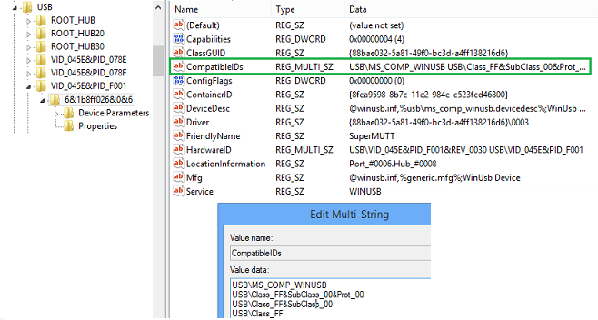

# USB Device Registry Entries


This topic describes the device-specific registry entries.

## Find device information after it enumerates on Windows


**View the device interface GUID, Hardware Id, and device class information about your device**

1.  Find this registry key and note the **DeviceInstance** value:

    **HKEY\_LOCAL\_MACHINE\\SYSTEM\\CurrentControlSet\\Control\\DeviceClasses\\**

    

2.  Find the device instance registry key and get the device interface GUID:

    **HKEY\_LOCAL\_MACHINE\\SYSTEM\\CurrentControlSet\\Enum\\USB\\&lt;hardware id&gt;\\&lt;instance id&gt;\\Device Parameters**

    

3.  Under the device instance key, note the device class, subclass, and protocol codes:

    **HKEY\_LOCAL\_MACHINE\\SYSTEM\\CurrentControlSet\\Enum\\USB**

    

## Registry settings for configuring USB driver stack behavior


The registry entries described in this topic are found under this key:

```
HKEY_LOCAL_MACHINE
   SYSTEM
      CurrentControlSet
         Control
            usbflags
               <VVVVPPPPRRRR>
                  <Device-specific registry entry>
```

In the ***vvvvpppprrrrr*** key,

-   *vvvv* is a 4-digit hexadecimal number that identifies the vendor
-   *pppp* is a 4-digit hexadecimal number that identifies the product
-   *rrrr* is a 4-digit hexadecimal number that contains the revision number of the device.

The vendor ID, product ID, and revision number values are obtained from the [USB device descriptor](usb-device-descriptors.md).
The following table describes the possible registry entries for the ***vvvvpppprrrrr*** key. The USB driver stack considers these entries as read-only values.

<table>
<colgroup>
<col width="33%" />
<col width="33%" />
<col width="33%" />
</colgroup>
<thead>
<tr class="header">
<th>Registry entry</th>
<th>Description</th>
<th>Possible values</th>
</tr>
</thead>
<tbody>
<tr class="odd">
<td><p><strong>osvc</strong></p>
<p>REG_BINARY</p>
<p>Supported on Windows XP and later versions.</p></td>
<td><p>Indicates whether the operating system queried the device for [Microsoft-Defined USB Descriptors](microsoft-defined-usb-descriptors.md). If the previously-attempted OS descriptor query was successful, the value contains the vendor code from the OS string descriptor.</p></td>
<td><ul>
<li><p>0x0000: The device did not provide a valid response to the Microsoft OS string descriptor request.</p></li>
<li><p>0x01xx: The device provided a valid response to the Microsoft OS string descriptor request, where xx is the <strong>bVendorCode</strong> contained in the response.</p></li>
</ul></td>
</tr>
<tr class="even">
<td><p><strong>IgnoreHWSerNum</strong></p>
<p>REG_BINARY</p>
<p>Supported on Windows Vista and later versions.</p></td>
<td><p>Indicates whether the USB driver stack must ignore the serial number of the device.</p></td>
<td><ul>
<li><p>0x0000: The setting is disabled.</p></li>
<li><p>0x0001: Forces the USB driver stack to ignore the serial number of the device. Therefore, the device instance is tied to the port to which the device is attached.</p></li>
</ul></td>
</tr>
<tr class="odd">
<td><p><strong>ResetOnResume</strong></p>
<p>REG_BINARY</p>
<p>Supported on Windows Vista and later versions.</p></td>
<td><p>Indicates whether the USB driver stack must reset the device when the port resumes from a sleep cycle.</p></td>
<td><ul>
<li><p>0x0000: The setting is disabled.</p></li>
<li><p>0x0001: Forces the USB driver stack to reset a device on port resume.</p></li>
</ul></td>
</tr>
</tbody>
</table>

 

## Related topics
[Microsoft-provided USB drivers](system-supplied-usb-drivers.md)  

--------------------
[Send comments about this topic to Microsoft](mailto:wsddocfb@microsoft.com?subject=Documentation%20feedback%20%5Busbcon\buses%5D:%20USB%20Device%20Registry%20Entries%20%20RELEASE:%20%281/26/2017%29&body=%0A%0APRIVACY%20STATEMENT%0A%0AWe%20use%20your%20feedback%20to%20improve%20the%20documentation.%20We%20don't%20use%20your%20email%20address%20for%20any%20other%20purpose,%20and%20we'll%20remove%20your%20email%20address%20from%20our%20system%20after%20the%20issue%20that%20you're%20reporting%20is%20fixed.%20While%20we're%20working%20to%20fix%20this%20issue,%20we%20might%20send%20you%20an%20email%20message%20to%20ask%20for%20more%20info.%20Later,%20we%20might%20also%20send%20you%20an%20email%20message%20to%20let%20you%20know%20that%20we've%20addressed%20your%20feedback.%0A%0AFor%20more%20info%20about%20Microsoft's%20privacy%20policy,%20see%20http://privacy.microsoft.com/default.aspx. "Send comments about this topic to Microsoft")


