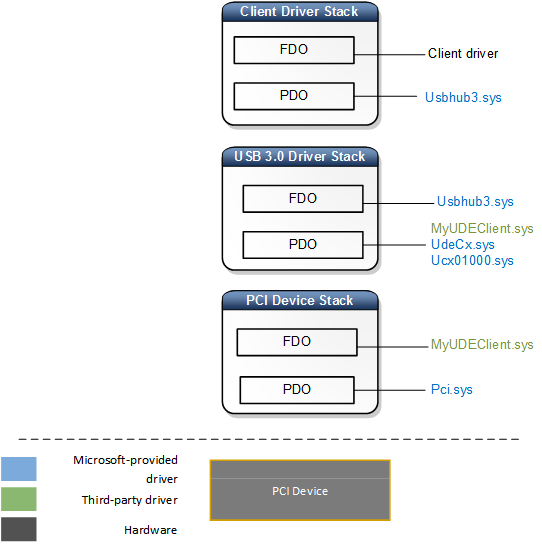

# Architecture: USB Device Emulation (UDE)

The section describes architecture of USB Device Emulation(UDE) that emulates the behavior of a USB host controller and a connected device. By using UDE, a non-USB hardware can communicate with the upper layers by using the [USB host-side drivers in Windows](usb-device-side-drivers-in-windows.md).

## UDE drivers

In the preceding image,

-   **USB hub driver (Usbhub3.sys)** is a KMDF driver. The hub driver is responsible for managing USB hubs and their ports, enumeration and creating physical device objects (PDOs) of USB devices and other hubs that may be attached to their downstream ports.
-   **USB host controller extension (Ucx01000.sys)** is an abstraction layer to the hub driver above in the stack, and provides a generic mechanism for queuing requests to the underlying host controller driver.
-   **UDE class extension** (UdeCx) is calls into the UDE client driver through client-implemented callback functions. The class extension provides routines for client driver to create UDE objects and manage them.
-   **UDE client driver** manages the hardware, interacting with both the WDF and UDE APIs. The upper edge communicates with both WDF and UDE class extension using USB constructs. Its lower edge communicates with the hardware using the hardware’s interface.
-   Custom hardware: For example, a PCI hardware can be emulated to work as a USB device.

## UDE device nodes

Here are the device stacks loaded for the UDE client driver:

 

 

--------------------
[Send comments about this topic to Microsoft](mailto:wsddocfb@microsoft.com?subject=Documentation%20feedback%20%5Busbcon\buses%5D:%20Architecture:%20USB%20Device%20Emulation%20%28UDE%29%20%20RELEASE:%20%281/26/2017%29&body=%0A%0APRIVACY%20STATEMENT%0A%0AWe%20use%20your%20feedback%20to%20improve%20the%20documentation.%20We%20don't%20use%20your%20email%20address%20for%20any%20other%20purpose,%20and%20we'll%20remove%20your%20email%20address%20from%20our%20system%20after%20the%20issue%20that%20you're%20reporting%20is%20fixed.%20While%20we're%20working%20to%20fix%20this%20issue,%20we%20might%20send%20you%20an%20email%20message%20to%20ask%20for%20more%20info.%20Later,%20we%20might%20also%20send%20you%20an%20email%20message%20to%20let%20you%20know%20that%20we've%20addressed%20your%20feedback.%0A%0AFor%20more%20info%20about%20Microsoft's%20privacy%20policy,%20see%20http://privacy.microsoft.com/default.aspx. "Send comments about this topic to Microsoft")

