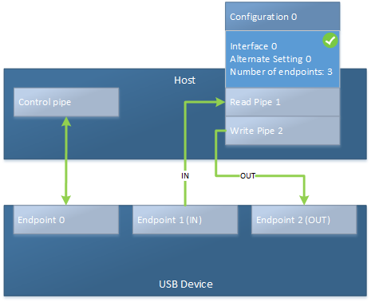

# USB endpoints and their pipes

**Summary**

-   Endpoint is hardware on the device; pipe is software on the host side.
-   Endpoint is not configured; pipe is configured for transfers
-   The host sends or receives data to or from a pipe.

A USB device has endpoints that are used to for data transfers. On the host side, endpoints are represented by pipes. This topic differentiates between those two terms.

## USB endpoint

An *endpoint* is a buffer on a USB device. Endpoint is a term that relates to the hardware itself, independent of the host operating system. The host can send and receive data to or from that buffer. Endpoints can be categorized into control and data endpoints.

Every USB device must provide at least one control endpoint at address 0 called the default endpoint or Endpoint0. This endpoint is bidirectional. that is, the host can send data to the endpoint and receive data from it within one transfer. The purpose of a control transfer is to enable the host to obtain device information, configure the device, or perform control operations that are unique to the device.

Data endpoints are optional and used for transferring data. They are unidirectional, has a type (control, interrupt, bulk, isochronous) and other properties. All those properties are described in an endpoint descriptor (see Standard USB descriptors).

In USB terminology, the direction of an endpoint ( and transfers to or from them) is based on the host. Thus, IN always refers to transfers to the host from a device and OUT always refers to transfers from the host to a device. USB devices can also support bi-directional transfers of control data.

The endpoints on a device are grouped into functional interfaces, and a set of interfaces makes up a device configuration. For more information, see USB device layout.

The host software can look at endpoint information, before the device has been configured or during selection of an alternate setting. You will iterate through all of the interfaces, then through each interfaces list of settings, and look at the properties of each endpoint or the entire set of endpoints in the setting. Looking at the endpoint information does not affect the configured state of the device.

## USB pipes

Data is transferred between a USB device and the USB host through an abstraction called a *pipe*. Pipes is purely a software term. A pipe talks to an endpoint on a device, and that endpoint has an address. The other end of a pipe is always the host controller.

A pipe for an endpoint is opened when the device is configured either by selecting a configuration and an interface's alternate setting. Therefore they become targets for I/O operations. A pipe has all the properties of an endpoint, but it is active and be used to communicate with the host.

An unconfigured endpoint is called an endpoint while a configured endpoint is called a pipe.

## Related topics
[Concepts for all USB developers](usb-concepts-for-all-developers.md)  

--------------------
[Send comments about this topic to Microsoft](mailto:wsddocfb@microsoft.com?subject=Documentation%20feedback%20%5Busbcon\buses%5D:%20USB%20endpoints%20and%20their%20pipes%20%20RELEASE:%20%281/26/2017%29&body=%0A%0APRIVACY%20STATEMENT%0A%0AWe%20use%20your%20feedback%20to%20improve%20the%20documentation.%20We%20don't%20use%20your%20email%20address%20for%20any%20other%20purpose,%20and%20we'll%20remove%20your%20email%20address%20from%20our%20system%20after%20the%20issue%20that%20you're%20reporting%20is%20fixed.%20While%20we're%20working%20to%20fix%20this%20issue,%20we%20might%20send%20you%20an%20email%20message%20to%20ask%20for%20more%20info.%20Later,%20we%20might%20also%20send%20you%20an%20email%20message%20to%20let%20you%20know%20that%20we've%20addressed%20your%20feedback.%0A%0AFor%20more%20info%20about%20Microsoft's%20privacy%20policy,%20see%20http://privacy.microsoft.com/default.aspx. "Send comments about this topic to Microsoft")

