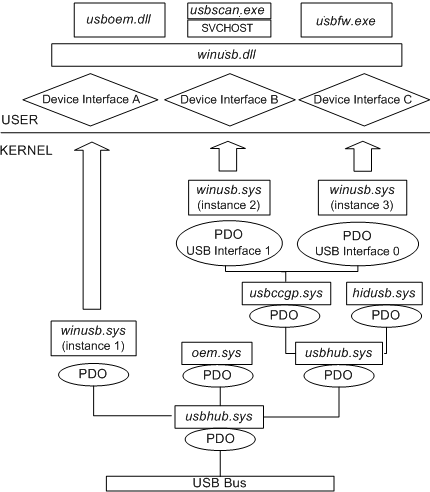

# WinUSB Architecture and Modules

[WinUSB](winusb.md) consists of two primary components:

-   Winusb.sys is a kernel-mode driver that can be installed as either a filter or function driver, above the protocol drivers in a USB device's kernel-mode device stack.
-   Winusb.dll is a user-mode DLL that exposes [WinUSB functions](https://msdn.microsoft.com/library/windows/hardware/ff540046#winusb). Applications can use these functions to communicate with Winusb.sys when it is installed as a device's function driver.

For devices that do not require a custom function driver, Winusb.sys can be installed in the device's kernel-mode stack as the function driver. User-mode processes can then communicate with Winusb.sys by using a set of device I/O control requests or by calling [WinUSB functions](https://msdn.microsoft.com/library/windows/hardware/ff540046#winusb).

The following figure shows a USB driver stack that contains several instances of Winusb.sys.

The preceding figure shows an example WinUSB configuration that implements three device interface classes, each of which has a single registered device interface:

-   Instance 1 of Winusb.sys registers Device Interface A, which supports a user-mode driver (Usboem.dll).
-   Instance 2 of Winusb.sys registers Device Interface B, which supports a user-mode driver for a scanner (Usbscan.exe) that communicates with Winusb.dll by using a system service (SVCHOST).
-   Instance 3 of Winusb.sys registers Device Interface C, which supports a firmware update utility (Usbfw.exe).

There is exactly one loaded instance of Winusb.sys. A PDO can represent a non-composite device (for example, instance 1 in the diagram) or it can represent an interface or interface collection on a composite device (for example, instances 2 and 3). For USB wireless mobile communication device class (WMCDC) devices, a PDO can even represent several interface collections. (For more information about PDOs for WMCDC devices, see [Enumerating Interface Collections on Wireless Mobile Communication Devices](enumerating-interface-collections-on-wireless-mobile-communication-dev.md).)

Any user-mode application can communicate with the USB stack by loading the WinUSB dynamic link library (Winusb.dll) and calling the WinUSB functions that are exposed by this module.

## Related topics

[WinUSB (winusb.sys) Installation](winusb-installation.md)

[How to Access a USB Device by Using WinUSB Functions](using-winusb-api-to-communicate-with-a-usb-device.md)

[WinUSB Functions for Pipe Policy Modification](winusb-functions-for-pipe-policy-modification.md)

[WinUSB Power Management](winusb-power-management.md)

[WinUSB Functions](https://msdn.microsoft.com/library/windows/hardware/ff540046#winusb)

[WinUSB](winusb.md)

 

 

[Send comments about this topic to Microsoft](mailto:wsddocfb@microsoft.com?subject=Documentation%20feedback%20%5Busbcon\buses%5D:%20WinUSB%20Architecture%20and%20Modules%20%20RELEASE:%20%281/26/2017%29&body=%0A%0APRIVACY%20STATEMENT%0A%0AWe%20use%20your%20feedback%20to%20improve%20the%20documentation.%20We%20don't%20use%20your%20email%20address%20for%20any%20other%20purpose,%20and%20we'll%20remove%20your%20email%20address%20from%20our%20system%20after%20the%20issue%20that%20you're%20reporting%20is%20fixed.%20While%20we're%20working%20to%20fix%20this%20issue,%20we%20might%20send%20you%20an%20email%20message%20to%20ask%20for%20more%20info.%20Later,%20we%20might%20also%20send%20you%20an%20email%20message%20to%20let%20you%20know%20that%20we've%20addressed%20your%20feedback.%0A%0AFor%20more%20info%20about%20Microsoft's%20privacy%20policy,%20see%20http://privacy.microsoft.com/default.aspx. "Send comments about this topic to Microsoft")

