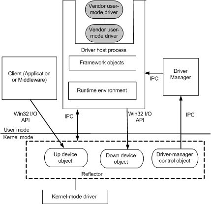

# Architecture of UMDF

This topic describes how the driver manager builds a user-mode device stack, and how the host process, reflector, and driver manager process an I/O request that an application sends to a User-Mode Driver Framework (UMDF) driver.

Similar to a kernel-mode stack, the construction and tear down of a user-mode stack is driven by Plug and Play (PnP) events. After the kernel-mode stack has been built, the reflector notifies the driver manager to start construction of the user-mode stack. The driver manager launches the driver host process and provides sufficient information to the launched process to build the user-mode stack. In this way, the user-mode stack can be considered an extension of the kernel-mode stack.

The driver host process provides the execution environment for user-mode drivers and routes messages between drivers in the user-mode stack. The reflector uses a message-based interprocess communication mechanism to communicate with the driver manager and host process.

To send an I/O request to a UMDF driver, an application calls a Win32 file I/O function, such as [**CreateFile**](https://msdn.microsoft.com/library/windows/desktop/aa363858), **ReadFileEx**, **CancelIoEx**, or [**DeviceIoControl**](https://msdn.microsoft.com/library/windows/desktop/aa363216). When the reflector receives a request from the client application, it sends the request to the appropriate driver host process. The driver host process then routes the request to the top of the correct user-mode device stack.

The request is either completed by one of the drivers in the user-mode stack or forwarded by one of the drivers back to the reflector. When the reflector receives a request from the user-mode driver stack, it sends the request down the kernel-mode stack for completion.

 

 

[Send comments about this topic to Microsoft](mailto:wsddocfb@microsoft.com?subject=Documentation%20feedback%20%5Bwdf\wdf%5D:%20Architecture%20of%20UMDF%20%20RELEASE:%20%283/16/2016%29&body=%0A%0APRIVACY%20STATEMENT%0A%0AWe%20use%20your%20feedback%20to%20improve%20the%20documentation.%20We%20don't%20use%20your%20email%20address%20for%20any%20other%20purpose,%20and%20we'll%20remove%20your%20email%20address%20from%20our%20system%20after%20the%20issue%20that%20you're%20reporting%20is%20fixed.%20While%20we're%20working%20to%20fix%20this%20issue,%20we%20might%20send%20you%20an%20email%20message%20to%20ask%20for%20more%20info.%20Later,%20we%20might%20also%20send%20you%20an%20email%20message%20to%20let%20you%20know%20that%20we've%20addressed%20your%20feedback.%0A%0AFor%20more%20info%20about%20Microsoft's%20privacy%20policy,%20see%20http://privacy.microsoft.com/default.aspx. "Send comments about this topic to Microsoft")

