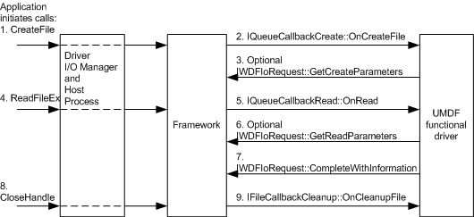

# Operation Flow with Single Device Stack

\[This topic applies to UMDF 1.*x*.\]

The following figure shows the flow of operations that occur to and from the UMDF functional driver in a single device stack.

**Note**   All I/O that is initiated by applications is routed through kernel mode as shown in the figures in the [Architecture of the UMDF](https://msdn.microsoft.com/library/windows/hardware/ff554461) section, even though the preceding figure does not show this situation.

 

The UMDF driver calls the [**IWDFIoRequest::GetCreateParameters**](https://msdn.microsoft.com/library/windows/hardware/ff559088) method only if it requires information about the file that is associated with the read request. The UMDF driver calls the [**IWDFIoRequest::GetReadParameters**](https://msdn.microsoft.com/library/windows/hardware/ff559113) method only if it requires more information about the read request.

The UMDF driver can call the [**IWDFIoRequest::Complete**](https://msdn.microsoft.com/library/windows/hardware/ff559070) method rather than the [**IWDFIoRequest::CompleteWithInformation**](https://msdn.microsoft.com/library/windows/hardware/ff559074) method if specifying the number of bytes that are transferred in the read operation is not required. The UMDF driver calls **Complete** or **CompleteWithInformation** to signal that the read operation is complete; the application can then access the read data.

 

 

[Send comments about this topic to Microsoft](mailto:wsddocfb@microsoft.com?subject=Documentation%20feedback%20%5Bwdf\wdf%5D:%20Operation%20Flow%20with%20Single%20Device%20Stack%20%20RELEASE:%20%283/15/2016%29&body=%0A%0APRIVACY%20STATEMENT%0A%0AWe%20use%20your%20feedback%20to%20improve%20the%20documentation.%20We%20don't%20use%20your%20email%20address%20for%20any%20other%20purpose,%20and%20we'll%20remove%20your%20email%20address%20from%20our%20system%20after%20the%20issue%20that%20you're%20reporting%20is%20fixed.%20While%20we're%20working%20to%20fix%20this%20issue,%20we%20might%20send%20you%20an%20email%20message%20to%20ask%20for%20more%20info.%20Later,%20we%20might%20also%20send%20you%20an%20email%20message%20to%20let%20you%20know%20that%20we've%20addressed%20your%20feedback.%0A%0AFor%20more%20info%20about%20Microsoft's%20privacy%20policy,%20see%20http://privacy.microsoft.com/default.aspx. "Send comments about this topic to Microsoft")

