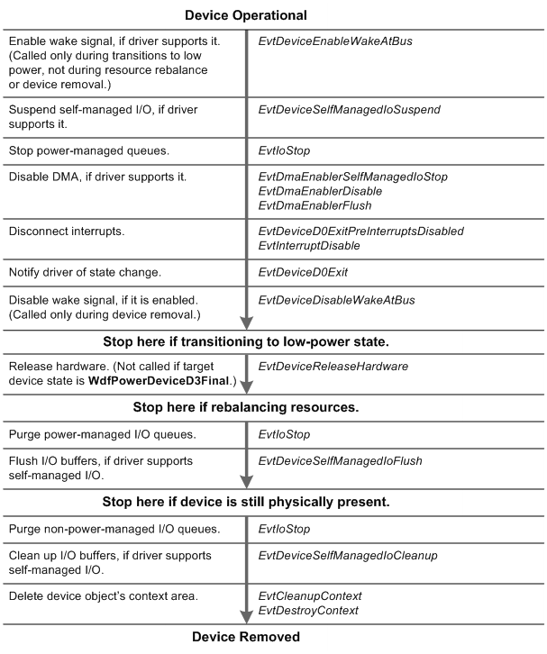

# Power-Down and Removal Sequence for a Bus Driver

The following figure shows the order in which the framework calls a KMDF bus driver's event callback functions when powering down and removing a device that is connected to the bus. The sequence starts at the top of the figure with an operational device that is in the working power state (D0):

The framework does not delete the PDO until the device is physically removed from the system. For example, if a user disables the device in Device Manager or stops it in the Safely Remove Hardware utility but does not physically remove the device, the framework retains the PDO. If the device is later re-enabled, the framework uses the same PDO and begins the startup sequence by calling the [*EvtDevicePrepareHardware*](https://msdn.microsoft.com/library/windows/hardware/ff540880) callback, as shown in [Power-Up Sequence for a Physical Device Object](power-up-sequence-for-a-bus-driver.md).

 

 

