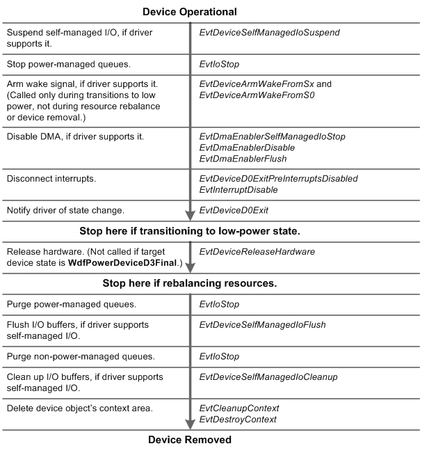

# Power-Down and Removal Sequence for a Function or Filter Driver

The following figure shows the order in which the framework calls a KMDF function or filter driver's event callback functions when powering down and removing the device. The sequence starts at the top of the figure with an operational device that is in the working power state (D0):

As the figure shows, the KMDF power-down and removal sequence involves calling the corresponding "undo" callbacks in the reverse order in which the framework called the functions that are involved in making the device operational. The framework deletes the device object after it deletes the device object context area.

 

 

[Send comments about this topic to Microsoft](mailto:wsddocfb@microsoft.com?subject=Documentation%20feedback%20%5Bwdf\wdf%5D:%20Power-Down%20and%20Removal%20Sequence%20for%20a%20Function%20or%20Filter%20Driver%20%20RELEASE:%20%283/24/2016%29&body=%0A%0APRIVACY%20STATEMENT%0A%0AWe%20use%20your%20feedback%20to%20improve%20the%20documentation.%20We%20don't%20use%20your%20email%20address%20for%20any%20other%20purpose,%20and%20we'll%20remove%20your%20email%20address%20from%20our%20system%20after%20the%20issue%20that%20you're%20reporting%20is%20fixed.%20While%20we're%20working%20to%20fix%20this%20issue,%20we%20might%20send%20you%20an%20email%20message%20to%20ask%20for%20more%20info.%20Later,%20we%20might%20also%20send%20you%20an%20email%20message%20to%20let%20you%20know%20that%20we've%20addressed%20your%20feedback.%0A%0AFor%20more%20info%20about%20Microsoft's%20privacy%20policy,%20see%20http://privacy.microsoft.com/default.aspx. "Send comments about this topic to Microsoft")

