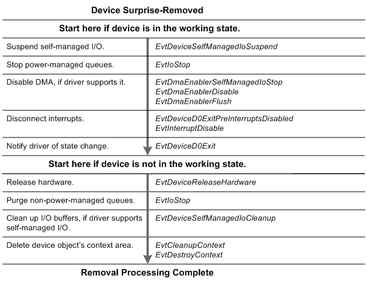

# Surprise-Removal Sequence

If the user removes the device without warning, by simply unplugging it without using Device Manager or the Safely Remove Hardware utility, the device is considered "surprise-removed." When this occurs, the framework follows a slightly different removal sequence. It also follows the surprise-removal sequence if another driver calls [**IoInvalidateDeviceState**](https://msdn.microsoft.com/library/windows/hardware/ff549361) on the device, even if the device is still physically present. In the surprise-removal sequence, the framework calls the [*EvtDeviceSurpriseRemoval*](https://msdn.microsoft.com/library/windows/hardware/ff540913) callback before calling any of the other callbacks in the removal sequence. When the sequence is complete, the framework destroys the device object. Drivers for all removable devices must ensure that the callbacks in both the shutdown and startup paths can handle failure, particularly failures that are caused by the removal of the hardware. Any attempts to access the hardware should not wait indefinitely, but should be subject to time-outs or a watchdog timer.

The following diagram shows the callbacks that are involved in a surprise removal:

If the device was not in the working state when it was removed, the framework calls the [*EvtDeviceReleaseHardware*](https://msdn.microsoft.com/library/windows/hardware/ff540890) event callback immediately after [*EvtDeviceSurpriseRemoval*](https://msdn.microsoft.com/library/windows/hardware/ff540913). It omits the intervening steps, which were already performed when the device exited from the working state.

 

 

[Send comments about this topic to Microsoft](mailto:wsddocfb@microsoft.com?subject=Documentation%20feedback%20%5Bwdf\wdf%5D:%20Surprise-Removal%20Sequence%20%20RELEASE:%20%284/5/2016%29&body=%0A%0APRIVACY%20STATEMENT%0A%0AWe%20use%20your%20feedback%20to%20improve%20the%20documentation.%20We%20don't%20use%20your%20email%20address%20for%20any%20other%20purpose,%20and%20we'll%20remove%20your%20email%20address%20from%20our%20system%20after%20the%20issue%20that%20you're%20reporting%20is%20fixed.%20While%20we're%20working%20to%20fix%20this%20issue,%20we%20might%20send%20you%20an%20email%20message%20to%20ask%20for%20more%20info.%20Later,%20we%20might%20also%20send%20you%20an%20email%20message%20to%20let%20you%20know%20that%20we've%20addressed%20your%20feedback.%0A%0AFor%20more%20info%20about%20Microsoft's%20privacy%20policy,%20see%20http://privacy.microsoft.com/default.aspx. "Send comments about this topic to Microsoft")

