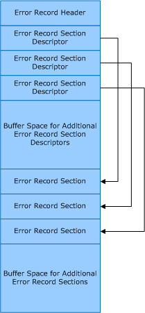

# Error Records

The Windows Hardware Error Architecture (WHEA) uses a standard error record format to represent all platform hardware errors. As a result, the system firmware, the Windows operating system, and user-mode applications can design hardware error reporting and recovery mechanisms that are all based on the same error record format.

The format of the error records that are used by WHEA are based on the *Common Platform Error Record* as described in Appendix N of version 2.2 of the [Unified Extensible Firmware Interface (UEFI) Specification](http://go.microsoft.com/fwlink/p/?linkid=69484).

The following diagram shows the general format of an error record.

An error record consists of an error record header followed by one or more fixed-length error record section descriptors. For each error record section descriptor there is an associated variable-length error record section that contains either error data or informational data. An error record must contain at least one error record section.

An error record can include extra buffer space for the dynamic addition of error record sections and section descriptors. The extra buffer space can also be used to dynamically increase the size of existing error record sections.

An error record is described by a [**WHEA\_ERROR\_RECORD**](https://msdn.microsoft.com/library/windows/hardware/ff560483) structure, the error record header is described by a [**WHEA\_ERROR\_RECORD\_HEADER**](https://msdn.microsoft.com/library/windows/hardware/ff560487) structure, and the error record section descriptors are each described by a [**WHEA\_ERROR\_RECORD\_SECTION\_DESCRIPTOR**](https://msdn.microsoft.com/library/windows/hardware/ff560496) structure.

Each error record section can be one of the following section types:

Hardware Error Packet  
This error record section contains the hardware error packet that was passed to the operating system by the low-level hardware error handler (LLHEH) that reported the error. The data that is contained in this section is described by the [WHEA\_ERROR\_PACKET](https://msdn.microsoft.com/library/windows/hardware/ff560465) structure.

Generic Processor Error  
This error record section contains processor error data that is not specific to a particular processor architecture. The data that is contained in this section is described by the [**WHEA\_PROCESSOR\_GENERIC\_ERROR\_SECTION**](https://msdn.microsoft.com/library/windows/hardware/ff560607) structure.

x86/x64 Processor Error  
This error record section contains processor error data that is specific to the x86 or x64 processor architecture. The data that is contained in this section is described by the [**WHEA\_XPF\_PROCESSOR\_ERROR\_SECTION**](https://msdn.microsoft.com/library/windows/hardware/ff560655) structure.

Itanium Processor Error  
This error record section contains processor error data that is specific to the Itanium processor architecture. For more information about the format of the error data that is contained in this error record section, see the [Intel Itanium Processor Family System Abstraction Layer Specification](http://go.microsoft.com/fwlink/p/?linkid=72212).

Itanium Processor Firmware Error Record Reference  
This error record section contains a reference to a firmware error record that is specific to the Itanium processor architecture. This error record section is described by a [**WHEA\_FIRMWARE\_ERROR\_RECORD\_REFERENCE**](https://msdn.microsoft.com/library/windows/hardware/ff560520) structure.

Platform Memory Error  
This error record section contains platform memory error data. The data that is contained in this section is described by the [**WHEA\_MEMORY\_ERROR\_SECTION**](https://msdn.microsoft.com/library/windows/hardware/ff560565) structure.

Nonmaskable Interrupt  
This error record section contains nonmaskable interrupt (NMI) data. The data that is contained in this section is described by the [**WHEA\_NMI\_ERROR\_SECTION**](https://msdn.microsoft.com/library/windows/hardware/ff560571) structure.

PCI Express Error  
This error record section contains PCI Express error data. The data that is contained in this section is described by the [**WHEA\_PCIEXPRESS\_ERROR\_SECTION**](https://msdn.microsoft.com/library/windows/hardware/ff560576) structure.

PCI/PCI-X Bus Error  
This error record section contains PCI/PCI-X bus error data. The data that is contained in this section is described by the [**WHEA\_PCIXBUS\_ERROR\_SECTION**](https://msdn.microsoft.com/library/windows/hardware/ff560583) structure.

PCI/PCI-X Device Error  
This error record section contains PCI/PCI-X device error data. The data that is contained in this section is described by the [**WHEA\_PCIXDEVICE\_ERROR\_SECTION**](https://msdn.microsoft.com/library/windows/hardware/ff560589) structure.

For additional hardware error data that does not fit into one of the section types in the previous list, a platform-specific error record section can be defined to contain the data. For each type of platform-specific error record section that is defined, a corresponding GUID that identifies the type of the error record section must be defined. This GUID is specified in the **SectionType** member of any [**WHEA\_ERROR\_RECORD\_SECTION\_DESCRIPTOR**](https://msdn.microsoft.com/library/windows/hardware/ff560496) structure that describes that type of error record section.

If there is additional hardware error data that does not fit into one of the section types in the previous list or into a defined platform-specific error record section, a generic error record section is used to contain the data.

 

 

--------------------
[Send comments about this topic to Microsoft](mailto:wsddocfb@microsoft.com?subject=Documentation%20feedback%20%5Bwhea\whea%5D:%20Error%20Records%20%20RELEASE:%20%289/14/2016%29&body=%0A%0APRIVACY%20STATEMENT%0A%0AWe%20use%20your%20feedback%20to%20improve%20the%20documentation.%20We%20don't%20use%20your%20email%20address%20for%20any%20other%20purpose,%20and%20we'll%20remove%20your%20email%20address%20from%20our%20system%20after%20the%20issue%20that%20you're%20reporting%20is%20fixed.%20While%20we're%20working%20to%20fix%20this%20issue,%20we%20might%20send%20you%20an%20email%20message%20to%20ask%20for%20more%20info.%20Later,%20we%20might%20also%20send%20you%20an%20email%20message%20to%20let%20you%20know%20that%20we've%20addressed%20your%20feedback.%0A%0AFor%20more%20info%20about%20Microsoft's%20privacy%20policy,%20see%20http://privacy.microsoft.com/default.aspx. "Send comments about this topic to Microsoft")

